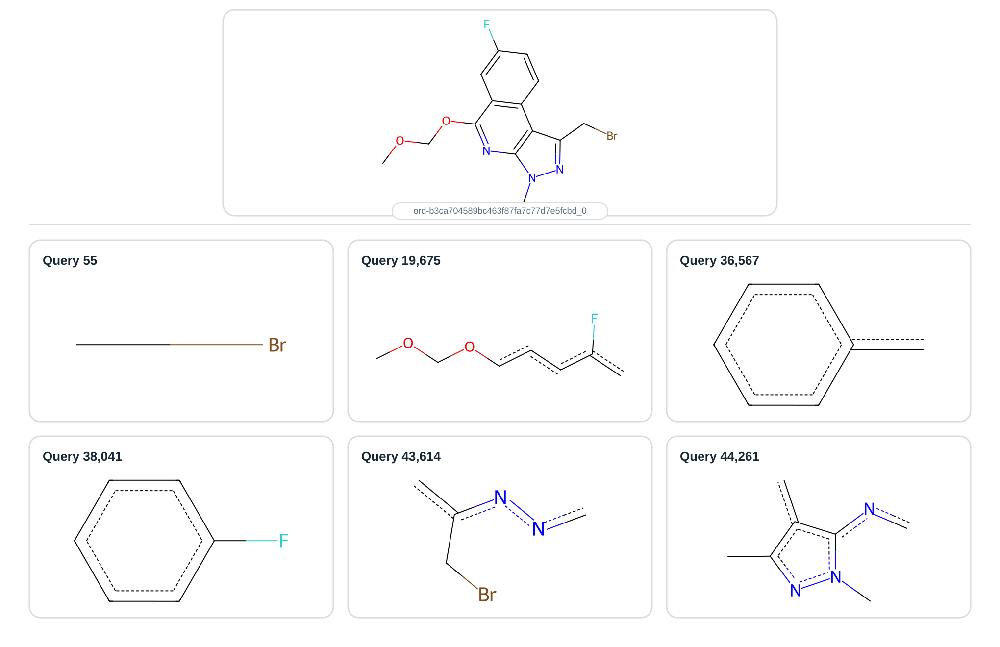

# Faster substructure search with Roaring bitmaps and an inverted index

This repository accompanies [article](https://cheminfo.dev/posts/faster-substructure-search-roaring-bitmaps-inverted-index/) about speeding up RDKit
substructure search. It compares a naive exact-match loop, Pattern fingerprint
screening, Roaring bitmaps, the PostgreSQL RDKit cartridge, a Roaring inverted
index, and a packed NumPy implementation.

The benchmark was inspired by Maciej Wójcikowski's RDKit UGM 2026 talk about the
use of Roaring bitmaps in Merck's Synthia retrosynthesis software.

## Contents

- [Benchmark](#benchmark)
- [Approaches](#approaches)
  - [Naive exact matching](#naive-exact-matching)
  - [Pattern fingerprints](#pattern-fingerprints)
  - [Roaring bitmaps](#roaring-bitmaps)
  - [PostgreSQL RDKit cartridge](#postgresql-rdkit-cartridge)
  - [Roaring postings list](#roaring-postings-list)
  - [Packed NumPy bitmaps](#packed-numpy-bitmaps)
- [Results](#results)
- [Reusable Roaring index](#reusable-roaring-index)
- [Run the benchmarks](#run-the-benchmarks)
- [Rebuild the dataset](#rebuild-the-dataset)

## Benchmark

The source data is the `uspto-grants` subset of the Open Reaction Database:
about 1.77 million atom-mapped patent reactions. Reaction templates are
extracted with AstraZeneca's `reaction-utils`, then split into reactant-side
SMARTS queries.

The benchmark samples:

- 1,000 unique reactants from `data/reactant_sample.csv`;
- 50,000 unique SMARTS queries from `data/substructure_sample.parquet`;
- 50 million possible reactant-query pairs;
- 27,723 exact matches.



## Approaches

### Naive exact matching

[`01_naive.py`](benchmarks/01_naive.py) sends every one of the 50 million pairs
directly to `HasSubstructMatch`. It is the simplest implementation and the
baseline for the benchmark.

### Pattern fingerprints

[`02_pattern.py`](benchmarks/02_pattern.py) creates a 2,048-bit RDKit
`PatternFingerprint` for every query and reactant. A query can only match when
all of its fingerprint bits are also present in the reactant fingerprint.
`AllProbeBitsMatch` applies this inexpensive test before exact matching.

### Roaring bitmaps

[`03_roaring_approach.py`](benchmarks/03_roaring_approach.py) stores the same
fingerprint bits in `pyroaring.BitMap` objects and uses `issubset` for the
screen. This is a small code change, but it makes the serial scan about four
times faster than RDKit's bit-vector check in this benchmark.

### PostgreSQL RDKit cartridge

[`benchmarks/postgres/`](benchmarks/postgres/) loads the SMARTS queries into a
PostgreSQL `qmol` column and builds a GiST index. The cartridge uses the same
general strategy: a Pattern fingerprint index removes impossible candidates,
then RDKit rechecks the survivors with an exact substructure match.

A single connection is slower than the serial Roaring loop here. Ten
connections reduce matching to about 1.6 seconds by using the available CPU
cores; adding CPU capacity without concurrent queries does not speed up this
workload.

### Roaring postings list

[`05_roaring_postings.py`](benchmarks/05_roaring_postings.py) builds an inverted
index over the Pattern fingerprint:

1. Each fingerprint bit maps to a Roaring bitmap of query IDs containing it.
2. Fingerprint bits are ranked by how often they occur in the queries.
3. For each reactant, the search selects 128 frequent bits that are absent.
4. The corresponding posting lists are combined to exclude impossible queries.
5. The remaining queries pass through the full fingerprint screen and exact
   RDKit match.

If a bit required by a query is missing from the reactant, that query cannot
match. The final two checks keep the result exact regardless of how many posting
lists are used.

### Packed NumPy bitmaps

[`05a_numpy_postings.py`](benchmarks/05a_numpy_postings.py) applies the same
algorithm with packed NumPy `uint64` arrays. Vectorized posting unions and
fingerprint checks make it the fastest single-process implementation here. The
Roaring version remains substantially easier to read and maintain.

## Results

These are the representative 50,000-query timings reported in the article.
Runs vary by a few percent.

| Approach | Script | Matching time |
|---|---|---:|
| Naive exact matching | `01_naive.py` | 76.307 s |
| RDKit Pattern fingerprint | `02_pattern.py` | 22.670 s |
| Roaring fingerprint scan | `03_roaring_approach.py` | 5.823 s |
| PostgreSQL, one connection | `postgres/bench.py` | 8.235 s |
| PostgreSQL, ten connections | `postgres/bench.py` | 1.600 s |
| Roaring postings list | `05_roaring_postings.py` | 1.610 s |
| NumPy postings list | `05a_numpy_postings.py` | **1.261 s** |

Index construction is outside the matching timer. The in-process measurements
were made on an Apple M4 with 10 cores and 24 GB of memory, using Python 3.13.14
and RDKit 2026.03.6. Raw measurements are in
[`benchmarks/timings.csv`](benchmarks/timings.csv).


The 200,000-query comparison returned the same 107,532 ordered matches from
both posting-index backends. NumPy took 5.25 seconds and Roaring took 7.45
seconds at that size.

## Reusable Roaring index

[`SubstructureQueryIndex`](benchmarks/query_index.py) keeps the query molecules,
fingerprints, postings, bit ranking, and query IDs together:

```python
from benchmarks.query_index import SubstructureQueryIndex

index = SubstructureQueryIndex.from_mols(query_mols)
matches = index.match(reactant_mol)
batch_matches = index.match_many(reactant_mols)
```

`match_many` returns one list of matching query molecules per reactant, in input
order. The complete index can also be serialized with `pickle` and loaded in
another Python process.

## Run the benchmarks

```bash
uv sync
uv run benchmarks/01_naive.py
uv run benchmarks/02_pattern.py
uv run benchmarks/03_roaring_approach.py
uv run benchmarks/05_roaring_postings.py
uv run benchmarks/05a_numpy_postings.py
# not included in the article
uv run benchmarks/04_roaring_multiprocessing.py --processes 10
```

Run the PostgreSQL 18 benchmark with Docker:

```bash
PG_MAJOR=18 uv run benchmarks/postgres/bench.py --phase setup
for phase in load index match verify; do
    PG_MAJOR=18 uv run benchmarks/postgres/bench.py --phase "$phase"
done
PG_MAJOR=18 uv run benchmarks/postgres/bench.py --phase match --connections 10
docker compose -f benchmarks/postgres/compose.yaml down -v
```

`PG_MAJOR` can also select PostgreSQL 16 or 17. Use a fresh Docker volume when
switching major versions.

## Rebuild the dataset

The sampled benchmark data is included in the repository. To rebuild it from
the Open Reaction Database, run:

```bash
REACTANT_SAMPLE=1000 SUBSTRUCTURE_SAMPLE=50000 SEED=42 ./run_pipeline.sh
```

The pipeline downloads about 1.1 GB, extracts templates, lists unique
reactants, and writes the sampled files under `data/`. Template extraction is
the slowest step and takes roughly 30 minutes with nine workers on the benchmark
machine.
