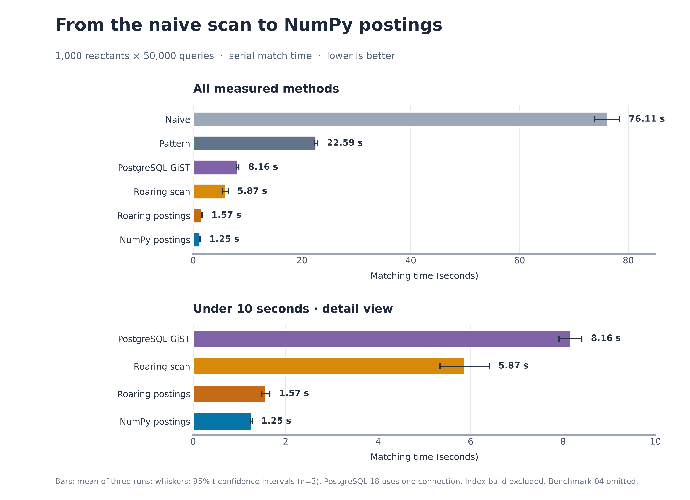
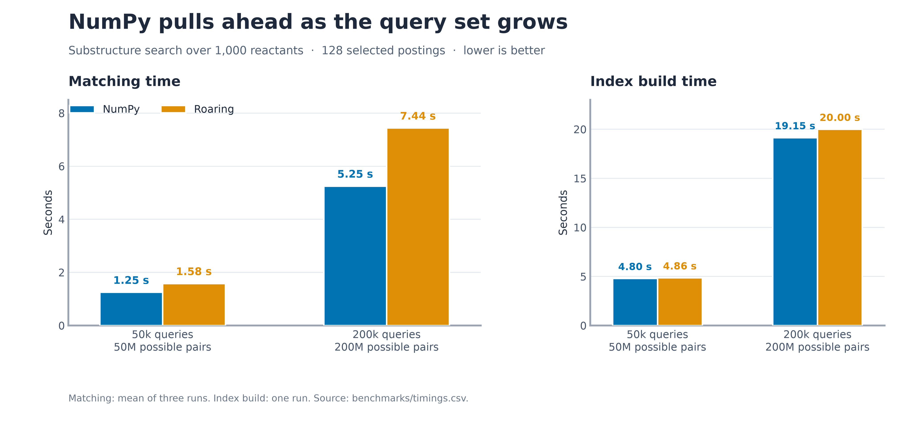

# roaring-substructure

Substructure screening benchmarks. Given a set of reactant molecules, which of a set of
query SMARTS does each one contain? The corpus comes from the Open Reaction Database:
`run_pipeline.sh` downloads the USPTO grants set, extracts the reactant-side substructures
with `rxnutils` templates, and samples both sides into `data/`.

The benchmark below runs that search with five screening strategies and the PostgreSQL RDKit cartridge.

## The task

1,000 reactants (`data/reactant_sample.csv`) x 50,000 substructures
(`data/substructure_sample.parquet`) = **50M pairs**, of which **27,723** are matches.
Every substructure is a query SMARTS — 100% carry `&D`/`&H` constraints and 44% use `[#n]`
wildcards, so all 50,000 fail `MolFromSmiles`. A Pattern-fingerprint screen passes 350,393
pairs (0.70%) on to the exact match.

## In process

The first three loops are written identically — columns materialised as lists, the timed loop
inside a function, labels carried rather than looked up — so the rows differ only in how
they screen. Each is the median of three interleaved runs, which land within 2–4%.

| script | screen | matching |
|---|---|---|
| `01_naive.py` | none — every pair goes to `HasSubstructMatch` | 75.5 s |
| `02_pattern.py` | RDKit `PatternFingerprint` + `AllProbeBitsMatch` | 23.1 s |
| `03_roaring_approach.py` | pyroaring `BitMap.issubset` | **5.9 s** |

`05_roaring_postings.py` changes the candidate search. It builds a Roaring posting bitmap
of substructure IDs for each of the 2,048 Pattern-fingerprint bits. For each reactant it
unions the postings for 128 high-frequency bits *absent* from that reactant, removes those
IDs, then applies the same full fingerprint subset check and exact RDKit match to the
remaining candidates. A query with any absent bit cannot match; the full screen keeps the
answer exact regardless of how many postings are used. Like the other scripts, index
construction is outside the matching timer.

The reusable `SubstructureQueryIndex.from_mols` builder keeps the query molecules,
fingerprints, postings, bit ranking and full ID bitmap together. The index can be
pickled and loaded in another Python process. `match(mol)` returns the matching query
molecules; `match_many(mols)` returns one such list per reactant, in input order.

Three runs of `05` took 1.610, 1.542 and 1.563 s (median **1.563 s**), about 3.8x faster
than `02`'s 5.9 s serial scan. The posting filter leaves 943,741 of the original 50M
pairs for the full fingerprint screen. The full match set equals the saved PostgreSQL
result: 27,723 pairs, with the same 350,393 fingerprint-screen passes. This is an in-process
Roaring benchmark; the original PostgreSQL image has RDKit but no Roaring extension.

### Benchmark 5a: NumPy packed bitmaps

`05a_numpy_postings.py` repeats benchmark 5 with packed NumPy `uint64` arrays
for query fingerprints and posting bitmaps. It keeps the same query order, 128 selected
absent-bit postings, fingerprint subset check, exact match, and `match_many` result shape.
The script runs each backend in a fresh process and verifies identical ordered match
sets. On macOS arm64 with Python 3.13.14, three matching runs per backend gave:

| bitmap | index build | median match | full index pickle | bitmap data pickle | added RSS after build |
|---|---:|---:|---:|---:|---:|
| Roaring | 4.86 s | 1.58 s | 111.1 MiB | 28.4 MiB | 103.7 MiB |
| NumPy `uint64` | 4.80 s | **1.25 s** | 106.9 MiB | 24.4 MiB | 85.7 MiB |

Both returned all 27,723 matches. NumPy unions selected postings and checks candidate
fingerprints in batches, then still calls RDKit for every exact match. Matching was about
20% faster than Roaring in this run. Added RSS
is the process's resident memory after index construction minus its resident memory
after loading the molecules; it includes allocator overhead, so it is an observed
process change rather than an exact object size. Index construction is excluded from
the matching timer.

For a larger check, `data/substructure_sample_200k.parquet` contains 200,000 distinct
queries drawn with seed 42 from the same source. It uses the existing 1,000-reactant
sample, giving 200 million possible pairs. Three matching runs per backend gave:

| bitmap | index build | median match | full index pickle | bitmap data pickle |
|---|---:|---:|---:|---:|
| Roaring | 20.00 s | 7.45 s | 441.7 MiB | 111.2 MiB |
| NumPy `uint64` | 19.15 s | **5.25 s** | 427.6 MiB | 97.7 MiB |

Both returned the same ordered 107,532 matches. NumPy's matching time was about 30%
lower. Process RSS fluctuated substantially at this size as the OS reclaimed pages,
so the serialized sizes are the more reproducible comparison of index footprint.
The sample can be regenerated from the tracked source data; the reactant output is
identical to the existing 1,000-reactant sample. To regenerate and repeat the larger run:

```bash
uv run scripts/subset_compounds.py --reactants 1000 --substructures 200000 --seed 42 \
  --reactants-out data/reactant_sample.csv \
  --substructures-out data/substructure_sample_200k.parquet
uv run benchmarks/05a_numpy_postings.py --queries-file data/substructure_sample_200k.parquet
```



The [all-methods SVG](benchmarks/plots/all_methods_50k.svg) has editable text. Regenerate
this chart from `benchmarks/timings.csv` with `uv run benchmarks/plot_all_methods.py`.
Benchmark 04 is omitted because it uses multiple processes.



The [SVG version](benchmarks/plots/postings_comparison.svg) has editable text. Regenerate
both figures from `benchmarks/timings.csv` with
`uv run benchmarks/plot_postings_comparison.py`.

The screen is worth 3.3x to a loop that would otherwise run 50M exact matches (`03` against
`01`), and screening with roaring bitmaps rather than RDKit bit vectors takes that to 12.8x
(`03` against `02`). On the predicate alone — measured separately, over 5M pairs — roaring
is 4.1x the faster (0.5 s against 2.2 s), which is most of the `01`-to-`02` difference of
3.9x.

Reaching those numbers meant removing Python overhead that had nothing to do with the
screening: iterating pandas Series in the inner loop costs 3.7x what iterating a list does
(~3.3 s over the 50M pairs), and a loop at module scope resolves its names through the
globals dict rather than as locals (~0.8 s). Before that work the three measured 29.1, 9.7
and 81.8 s. None of it is algorithmic — `02` is still 50M `issubset` calls, and that scan is
now about 60% of what is left.

Container choice is not a further lever, which is worth knowing before reaching for it:
iterating tuples and iterating lists measure identically (they share the iterator protocol,
which yields borrowed pointers either way), and dropping the substructure SMARTS from the
inner loop — fetching two elements per pair instead of three, and looking the label up only
on the 0.055% of pairs that match — measured 5.88 s against 5.82 s, below the noise.

## In PostgreSQL

`benchmarks/postgres/` does the same search with the substructures stored as `qmol` in an
indexed column. The database holds the queries and nothing else — one table,
`substructures(idx, qmol)`; each reactant is passed with its own query.

| | load | index build | matching |
|---|---|---|---|
| PostgreSQL 16.15 | 3.68 s | 4.67 s | **7.77 s** |
| PostgreSQL 17.11 | 3.63 s | 4.65 s | **7.81 s** |
| PostgreSQL 18.6 | 3.60 s | 4.68 s | **7.87 s** |

50,000 rows, a 21 MB GiST index on a 57 MB heap (78 MB with indexes), and the same 27,723
matches every time. Load and index are one-off; matching is the comparable number.

The cartridge edges past `02`'s serial Roaring scan by about 20% and beats the RDKit bit vector by
3.7x, and it is not a different algorithm: `gmol_compress` stores `PatternFingerprintMol(mol,
rdkit.sss_fp_size)` as the index signature — the same fingerprint `01` computes by hand —
and `gmol_consistent` sets `recheck`, so the exact `SubstructMatch` still runs on every
candidate. `EXPLAIN (ANALYZE, BUFFERS)` on a representative reactant shows the shape:
468 candidates screened, **443 removed by index recheck**, 25 real matches, 9.6 ms.

The three majors are within 1.3% of each other, which is smaller than run-to-run variance
here — whatever decides this workload, it is not the server version.

## Tuning

The cartridge docs recommend four PostgreSQL settings and one cartridge GUC. Measured one
at a time on PostgreSQL 18.6, everything else at its default:

| setting | value | matching |
|---|---|---|
| `rdkit.sss_fp_size` | 64 | 793.4 s |
| | 256 | 61.0 s |
| | 1024 | 10.4 s |
| | **2048 (default)** | **7.84 s** |
| | 4096 | 29.2 s |
| `rdkit.do_chiral_sss` | on | 8.44 s |
| `shared_buffers` | 16 MB | 12.55 s |
| `shared_buffers` | 64 MB | 7.96 s |
| `shared_buffers` + `work_mem` | 2 GB / 128 MB | 8.11 s |
| `synchronous_commit` + `full_page_writes` | off / off | load 3.57 s, index 4.68 s |

Repeats of the default configuration span 7.84–8.11 s, so anything inside about 3% is
noise rather than signal.

**`sss_fp_size` is the only knob that matters, and the default is the optimum.** A warm
`EXPLAIN (ANALYZE, BUFFERS)` on the same reactant at 2048 and 4096 shows why bigger is not
better: candidates surviving the screen fall from 468 to 356 (24%), but the scan touches
3960 buffer pages against 3093 (28% more) and compares twice as many bytes of signature
per candidate, so that query goes from 9.3 ms to 30.1 ms. Going the other way the screen stops
pruning: at 64 bits the exact match runs on so many candidates that matching takes 793 s,
thirteen minutes. Every size returned the same 27,723 matches, and 64 — the most
aggressive screen — passed the per-pair verification, so this setting moves speed only,
never the answer.

**The PostgreSQL advice does nothing at this scale.** The working set is 78 MB — a 57 MB
heap and a 21 MB index — and one query touches about 24 MB of it (3093 buffers), so the
default 128 MB `shared_buffers` already holds everything the scan reads and 2 GB has
nothing left to cache. Push it the other way, to 16 MB, which is below the index, and
matching slows by 60%; that is where the parameter starts to matter. `work_mem` is never
exercised at all: the plan is a plain `Index Scan`, with no Sort, Hash or Bitmap for it to
fund. The load and index-build advice has nothing to bite on either — 50,000 rows is a
handful of transactions, and turning off `synchronous_commit` and `full_page_writes` moved
the load by 0.04 s. The docs' own figures for these settings come from indexing six
million molecules, which is the scale at which they earn their place.

**`do_chiral_sss` is a semantics knob, not a speed knob.** Turning it on removes 420
matches (27,303 rather than 27,723) and fails the reference check by construction, since
the reference matches non-chirally. Over the first 100 reactants its losses are
pair-for-pair identical to Python's `useChirality=True` — the cartridge agrees with
in-process RDKit even in this deviation. All 37 substructures involved carry
stereochemistry in their source SMARTS (30 tetrahedral `@`, 7 `/` or `\` bonds), but `@`
does not survive loading, as the round-trip check shows, while `/` and `\` do. So the
losses cannot be attributed to the query's tetrahedral specification alone; the mechanism
is unattributed, and at the defaults it does not arise.

**Parallelism is the one big lever.** The 7.9 s above is a single connection issuing 1,000
queries one after another, which `docker stats` shows running at ~96% of one core — the
container itself has ten available and no CPU limit. `--phase match --connections N` is the
same run spread over N connections, one reactant each, nothing else changed:

| connections | matching | speedup |
|---|---|---|
| 1 | 7.96 s | — |
| 2 | 4.41 s | 1.8x |
| 4 | 2.40 s | 3.3x |
| 8 | 1.69 s | 4.7x |
| 10 | 1.60 s | 5.0x |

5x rather than 10x, because past a few connections the shared index and cache are the
bottleneck, not the cores.

`benchmarks/04_roaring_multiprocessing.py` is the in-process counterpart — 02's inner loop
over worker processes, reporting the same `(reactant index, substructure index)` pairs.
Run head to head at the same concurrency:

| | 1 worker | 10 workers |
|---|---|---|
| in-process, roaring | 5.9 s (`02`) | **1.30 s** (`04`) |
| PostgreSQL cartridge | 7.96 s | 1.60 s |

(the database row is the 1- and 10-connection rows of the table above; repeats vary by ~3%)

In the `02`/`04` comparison, the serial in-process search is faster — 5.9 s against 7.9 s — and
it stays ahead once both are given the machine, by about 20%. `04` at one process is a
little slower than `02` (6.3 s) because it pickles the reactant molecules out to the worker
and the match pairs back; that is the cost of the split, not of the screening. The
database's compensating advantage is that it needs no code change to use the machine.

Batching all 1,000 reactants into one statement is worth about 3% (7.70 s) and only if it
is written carefully. The obvious form — `CROSS JOIN LATERAL (... qmol <@ (SELECT
mol_from_smiles(r.smi)))`, with the molecule derived from the outer row — is correlated, so
the recheck re-evaluates it for every candidate and the whole thing runs 3.5x *slower*
(28.15 s, index scan 26.2 ms per reactant against 9.6 ms standalone). `WITH q AS
MATERIALIZED (...)` makes the molecule a column value and the scan returns to 6.7 ms.

Two things that suggest themselves and do not work. A covering index
(`gist (qmol) INCLUDE (idx)`, then `VACUUM`) cannot produce an index-only scan, because
`recheck` has to read the heap row to run the exact match — 7.99 s against 7.91 s, and the
plan is unchanged. And parallel query has nothing to parallelise: the plan is one index
scan per query, which PostgreSQL does not fan out, not a large scan it would. JIT is
enabled but likewise never triggers — the query costs ~213 against a `jit_above_cost` of
100000.

## Method

All numbers are wall clock on the same machine (Apple M4, 10 cores, 24 GB, macOS 27;
Python 3.13.14, RDKit 2026.03.6). Both sides time only the search: the 50,000 substructure
fingerprints and the index build happen outside the timer, while each query's own
fingerprint is inside it — the in-process scripts report it as `Matching took N seconds.`
The database figure includes 1,000 client round trips and per-query planning that the
in-process runs do not have. Server settings are pinned in `compose.yaml` so the answers
can agree with Python's defaults: `rdkit.sss_fp_size=2048` (baked into the index signature),
`rdkit.do_chiral_sss=off` and `do_enhanced_stereo_sss=off` (Python's `HasSubstructMatch`
is non-chiral by default), and `max_parallel_workers_per_gather=0` because the in-process
loops are single-threaded. A warm-up pass runs before the timed loop.

Raw timings are in `benchmarks/timings.csv` — three runs of each benchmark, long form
(`benchmark,run,phase,seconds,matches`). They put the spread at a couple of percent in
process (`02`: 5.69–6.11 s) but nearer five for the database, where all three phases move
together between sessions: that file measures `postgres18` matching at 8.19 s against the
7.87 s in the table above, with load and index build up by the same small fraction, which
is session state rather than anything specific to the search. Treat these tables as
indicative to a few percent, not to the last digit.

## Things worth knowing before copying any of this

- **`qmol_from_smarts` takes `cstring`**, not the `text` that current RDKit sources
  declare, and it is the only route to a query molecule. Casting text to `qmol` parses
  **SMILES**: `'not a smarts'::qmol` raises `could not create molecule from SMILES`. Since
  every substructure here is a SMARTS, anything that reaches a `mol` or `qmol` context as
  text is parsed as the wrong language. SMARTS go to a staging text column and are
  converted explicitly.
- **A query like `qmol <@ mol_from_smiles(%s)` is 3.2x slower than it looks.** Once the
  statement is prepared and planned generically, the function call sits in the qual and is
  re-evaluated for every tuple the recheck touches — 443 redundant parses per query. The
  wrapping scalar subquery in `bench.py` is load-bearing: it makes the call an InitPlan
  evaluated once, which is fast in every plan mode.
- **The `qmol` GiST index is documented nowhere** in `Cartridge.html`, which only ever
  shows `USING gist(mol)`. It exists as `gist_qmol_ops` in `rdkit.sql.in`, and a `qmol` can never be the target side: the indexed form is `stored_qmol <@ query_mol`.

## Reproducing

```bash
uv run benchmarks/01_naive.py
uv run benchmarks/02_pattern.py
uv run benchmarks/03_roaring_approach.py
uv run benchmarks/04_roaring_multiprocessing.py --processes 10
uv run benchmarks/05_roaring_postings.py
uv run benchmarks/05a_numpy_postings.py
uv run benchmarks/06_rust_postings.py
uv run benchmarks/07_rust_postings_process.py
uv run benchmarks/09_rust_native.py

PG_MAJOR=18 uv run benchmarks/postgres/bench.py --phase setup   # pulls and starts the server
for phase in load index match verify; do
    PG_MAJOR=18 uv run benchmarks/postgres/bench.py --phase $phase
done
PG_MAJOR=18 uv run benchmarks/postgres/bench.py --phase match --connections 10
docker compose -f benchmarks/postgres/compose.yaml down -v
```

`PG_MAJOR` selects 16, 17 or 18 and needs a fresh volume when it changes. `SSS_FP_SIZE`,
`DO_CHIRAL_SSS`, `SHARED_BUFFERS`, `WORK_MEM`, `SYNCHRONOUS_COMMIT` and `FULL_PAGE_WRITES`
override the settings in `compose.yaml` for a tuning run — for example
`SSS_FP_SIZE=4096 ... --phase setup` restarts the server with a 4096-bit screen. Phases
share the database through the compose volume; `verify` needs no database at all. Match
sets and query plans land in `benchmarks/postgres/artifacts/`, which is gitignored.
